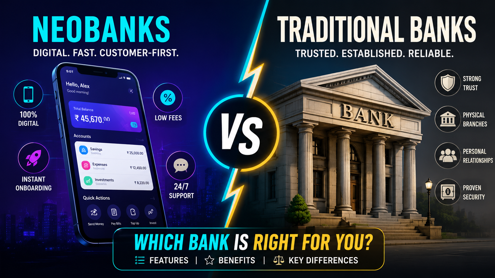

# neobanks-vs-traditional-banks-comparison
Comparative financial performance and customer experience analysis between neobanks and traditional banks, covering cost efficiency, CAC, and NPS metrics.

